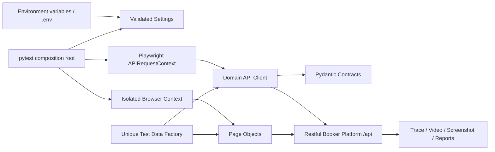

# Architecture

## Design goals

The framework is optimized for maintainable automation across multiple test layers and deployment
environments. The design favors explicit contracts and composition over inheritance-heavy utility
classes.

Primary goals:

- one coherent UI/API portfolio project;
- deterministic pull-request feedback and deeper scheduled coverage;
- high-signal failures with the request, response, screenshot, video, and trace evidence needed to
  diagnose them;
- independent and parallel-safe tests;
- business-readable tests without selectors, routes, credentials, or cleanup mechanics in test
  bodies;
- easy extension to additional domains, environments, browsers, and CI shards.

## System view



## Layer responsibilities

### Configuration

`Settings` is the only place that understands environment variables. Invalid URLs and timeout
values fail during session startup instead of halfway through a run. Each xdist worker caches its
own immutable settings object.

### API contracts and client

Pydantic models translate wire names such as `roomid` into Python names such as `room_id` while
serializing back to the exact API format. Unknown fields are rejected intentionally: a contract
change should be visible and reviewed, not silently ignored.

`RestfulBookerApi` owns paths, token propagation, and serialization. It returns the original
Playwright response so tests remain responsible for expected status and business assertions.
`expect_status` adds the URL and response body to failures without creating a hidden assertion
framework.

### UI pages

Page objects expose user behavior (`sign_in`, `expect_quote`, `enter_guest`) rather than raw
selectors. Locators prefer roles, names, and labels, matching how users and accessibility tools
perceive the product. A shared base applies environment URLs and timeout budgets.

### Test data

Factories create valid domain objects with a short unique fingerprint. The data can be identified
across UI, API, logs, and databases, and concurrent workers do not rely on shared IDs or execution
order.

### Pytest composition

`tests/conftest.py` owns lifecycle and policy:

- a session API context per worker;
- a fresh browser context/page per UI test from the Playwright plugin;
- authenticated client composition;
- cleanup registries;
- deterministic future booking windows;
- mutation opt-in at collection time.

## Dependency rules

```text
tests -> page objects / API client / factories / contracts
page objects -> settings + Playwright
API client -> contracts + Playwright
factories -> contracts
contracts -> Pydantic
settings -> pydantic-settings
```

Tests may combine public layers. Page objects and clients must not import tests, and UI code must
not call API clients internally. Cross-layer orchestration belongs in tests or higher-level
workflows so setup strategy stays visible.

## Scale path

When the suite grows:

1. Split clients/pages by bounded business domain, not by HTTP verb or HTML element type.
2. Add pytest markers that reflect pipeline decisions (component, risk, ownership).
3. Shard stable API/UI suites across xdist workers or CI jobs; never add test ordering.
4. Move environment provisioning into a deployment pipeline and pass its URL to this repository.
5. Publish JUnit and artifacts to the organization’s test-observability system.
6. Add contract generation/consumer checks only where ownership and release coupling justify it.

## Deliberate exclusions

- No singleton browser or shared page: both create state leakage.
- No arbitrary sleeps in page objects: Playwright locators and assertions auto-wait.
- No base class for tests: pytest fixtures compose dependencies more cleanly.
- No test-order or dependency plugin: every test must be independently runnable.
- No default mutation against a shared public target.
- No Allure dependency: HTML, JUnit, and native Playwright traces work without a Java report server.
